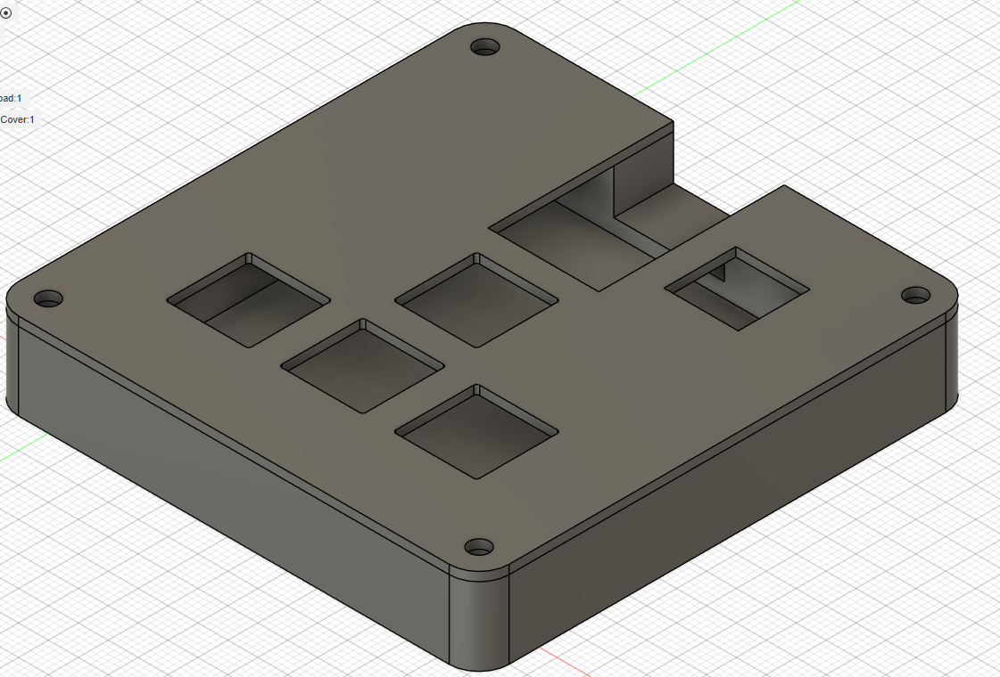

# RohansMacroPad

## What it is
I wanted to follow the tutorial on [hackpad.hackclub.com](hackpad.hackclub.com) accurately and make a macropad with 4 buttons, a XIAO thingy, and two LEDs.

## What it does
Gives me one point on Highway per extra key I will now have to press and make my computer do things.

## What it looks like
This is an image of the PCB plan, from KiCad.

This is an image of the schematic, from KiCad.

This is an image of the Hackpad case.

## How I made it
I followed the tutorial on Hackclub's website! It was vague at times, but it was very good at teaching me the basics of everything!
